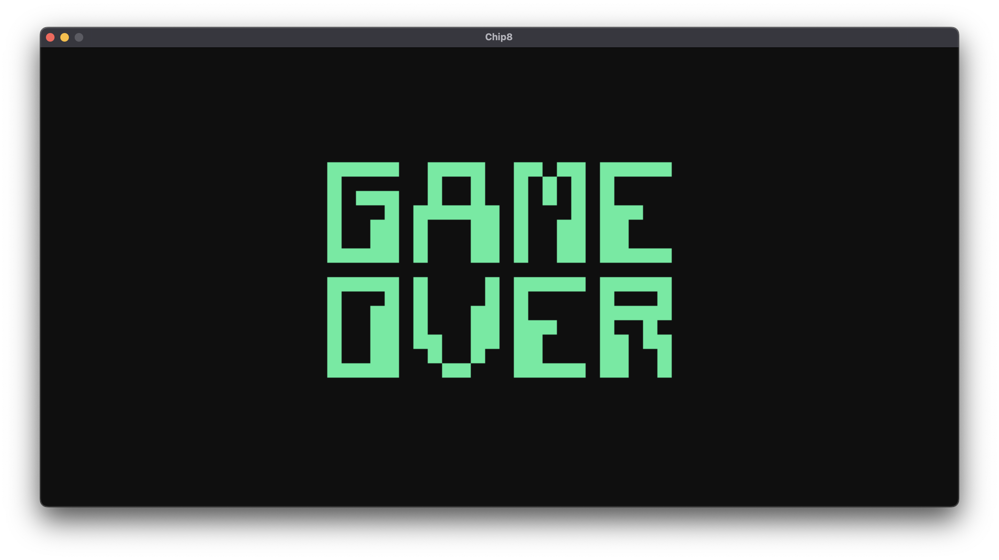

## Introduction

This is a chip-8 VM built in Rust.

## Resources

These were the most useful chip-8 references I found.

* [Mastering Chip-8](http://mattmik.com/files/chip8/mastering/chip8.html)
* [Cowgod's Chip-8 Reference](http://devernay.free.fr/hacks/chip8/C8TECH10.HTM)

## Requirements

You need to have sdl2 installed with headers. On macOS, this did the trick:

```bash
brew install sdl2
```

Make sure to have the right library environment variable in the path:

```bash
export LIBRARY_PATH="$LIBRARY_PATH:/opt/homebrew/lib"
```

## Usage

To use this project, follow these steps:

Clone the repository to your local machine:

```bash
git clone <repository_url>
cd <repository_name>
```

Run the program with the path to your game file:

```bash
cargo run /path/to/game
```

To enable debug logging and save the output to a file (`debug.log`), use the following command:

```bash
RUST_LOG=debug cargo run /path/to/game
```

## Games

You can find public-domain games [here](https://www.zophar.net/pdroms/chip8/chip-8-games-pack.html). 


